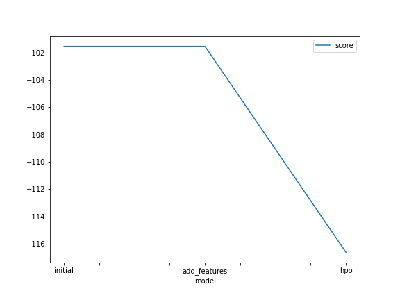
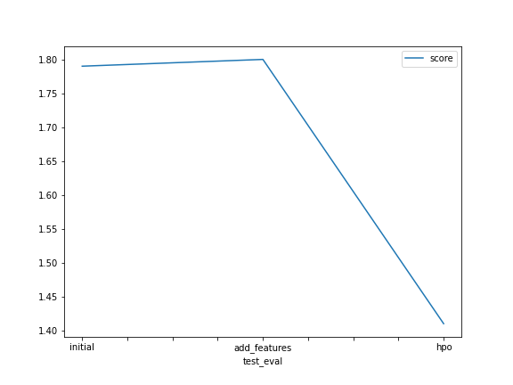

# Report: Predict Bike Sharing Demand with AutoGluon Solution
#### Bousbiat Hafsa

## Initial Training
### What did you realize when you tried to submit your predictions? What changes were needed to the output of the predictor to submit your results?
The negative values needed to be filtered and replaced with 0 values.

### What was the top ranked model that performed?
The model with default parameters, with a WeightedEnsemble_L3 being the top performer

## Exploratory data analysis and feature creation
### What did the exploratory analysis find and how did you add additional features?
The day, the month and the year were extracted. 

### How much better did your model preform after adding additional features and why do you think that is?
Unfortunately, the model did not improve

## Hyper parameter tuning
### How much better did your model preform after trying different hyper parameters?
The score imrpoved from 1.78 and 1.80 to 1.41

### If you were given more time with this dataset, where do you think you would spend more time?
I will spend more time on  the hyperparamers optimisation since it showed the biggest enhancement in the performance.

### Create a table with the models you ran, the hyperparameters modified, and the kaggle score.
|model|hpo1|hpo2|hpo3|score|
|--|--|--|--|--|
|initial|default_vals|default_vals|1.79|
|add_features|default_vals|default_vals|default_vals|1.80|
|hpo|'CAT': {'iterations': 1000}|'RF': {'n_estimators': 500}|'XT': {'n_estimators': 500}|1.41|

### Create a line plot showing the top model score for the three (or more) training runs during the project.

### Create a line plot showing the top kaggle score for the three (or more) prediction submissions during the project.

## Summary
The current project allowed to use autogluon to train several models with minimal coding efforts for the case of bike sharing. The exploration of hyperparameters significantly enhanced the performance of the model on the testing data. 
